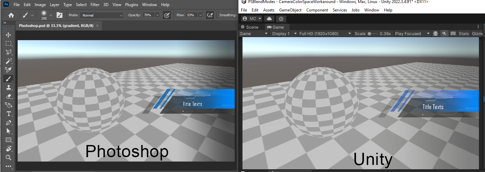
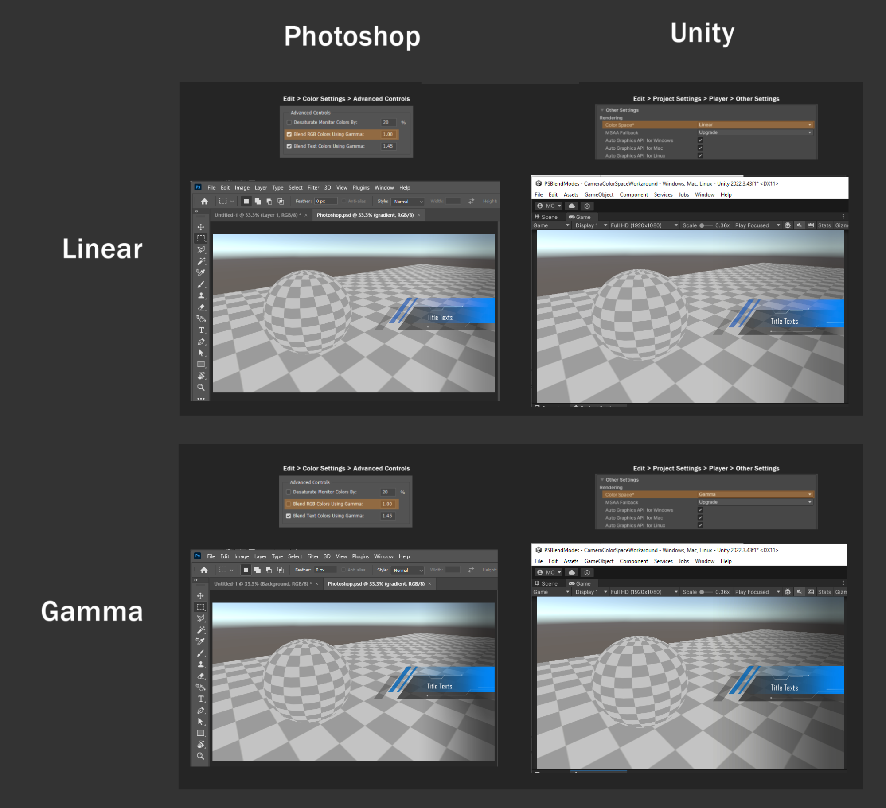
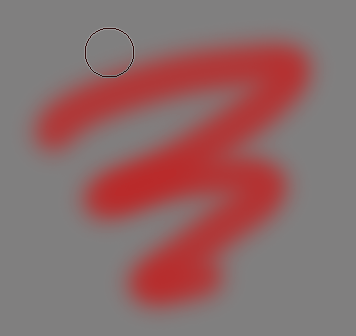
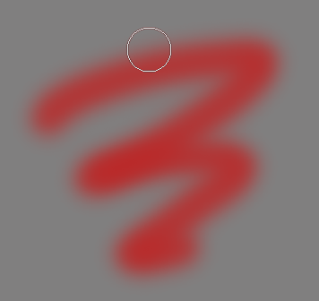
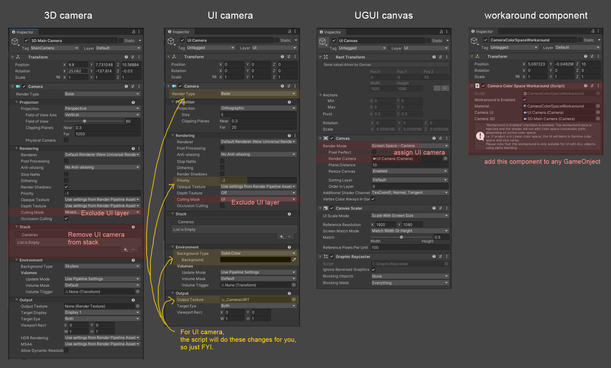
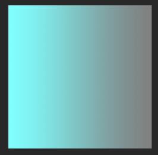
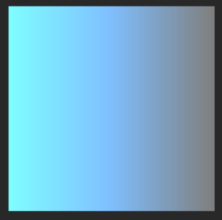

# CameraColorSpaceWorkaround

> [!NOTE]
> Unity 6.0+ and Universal Render Pipeline (URP) only. See branches for other versions.

<br>

## What’s happened?

After artists designed UI sprites in Photoshop, they exported the images into Unity and assembled the UI, the colors on the semi-transparent part looks different compared to how it looks like in Photoshop.



<br>

## Why?

This is because **color space** is not set up to work the same in Unity and Photoshop.
See below to find out what settings in both that need to match:

| Description | Photoshop | Unity |
| ----------- | --------- | ----- |
| Settings Location | Edit > Color Settings > Advanced Controls > Blend RGB Colors Using Gamma [1.00] | Edit > Project Settings > Player > Other Settings > Color Space |
| Linear Settings Value | ON | Linear |
| Gamma Settings Value | OFF | Gamma |



<br>

## Which combination of settings should you use?

It depnds on your **Unity project**.

The Unity project can be on `Gamma Color Space` if it’s a 2D game, or a 3D game with very simple shading. Using Gamma Color Space in this case can save some performance as Unity doesn’t need to do final gamma correction after rendering everything, since all colors are in gamma color space already.

The Unity project will need to be on `Linear Color Space` if it needs accurate lighting rendering. See [documentation](https://docs.unity3d.com/Manual/LinearRendering-LinearOrGammaWorkflow.html). Basically modern 3D game projects are recommended to be in Linear Color Space.

Therefore, the ideal case is - either **from the beginning** of the production or **before artists merge the layers** and export the sprites, ask the artists to change the settings in Photopshop accordingly. But make sure they are aware this will affect how they paint:

When Photoshop `Blend RGB Colors Using Gamma [1.00]` checkbox is:
| ON | OFF |
| ----------- | --------- |
|  |  |

<br>

## But it’s too late… Any workaround?

### 🙂 Yes:

If your UI objects only use **alpha blending** mode ([in Photoshop it is called “Normal”](https://helpx.adobe.com/photoshop/using/blending-modes.html)), you can apply Linear / Gamma blending in Unity by sacrificing some runtime performance.

The idea is to render the entire UI into a RenderTexture first, and then after 3D camera’s rendering, blend the UI and 3D camera’s content onto the screen manually.


The workaround code and set up can be found in the `CameraColorSpaceWorkaround` folder of this repository. The setup is basically:

> [!TIP]
> In U6, if you want to have post-processing for UI Camera, make sure to go to Render Pipeline Asset > Post-processing > enable Alpha Processing checkbox.
> The UI camera can of course also "re-use" the 3D camera's post-processing by setting blendEvent on the workaround component to make the 3D+UI blending happens before 3D camera renders post-processing (beforeRenderingPostProcessing).



<br>

### ☹️ No:

If the UI consists of many layers and each layer uses a **different** blending mode - there is no easy trick to workaround this. The best is still to ask artists to try their best modifying their images.

This is because the layers are supposed to be blended differently, if we apply the above workaround, let's say some semi-transparent parts that are supposed to be additive, some are alpha-blended, the additive parts will become dark as all these layers are “merged” into one and blended with only one blend mode (alpha blendiing).

Speaking of additive blending mode, the Photoshop blending mode `Linear Dodge (Add)` does not work entirely the same as any additive shader you find in Unity because it is limited by the GPU. The result of the additive color is always clamped before the layer blends with the one below in Photoshop. In Unity, the additive color is not clamped.

| Photoshop Linear Dodge (Add) | Unity Additive shader |
| ----------- | --------- |
| ```colorAdditive = colorBase + colorTop;```<br>```colorAdditive = saturate(colorAdditive);```<br>```result = lerp(colorBase, colorAdditive, alpha);``` | ```colorAdditive = colorBase + colorTop;```<br><br>```result = lerp(colorBase, colorAdditive, alpha);``` |
|  |  |

In this repo there are some test shaders that you can play with. See the `Test` folder.

Since if we blend the colors manually we can achieve the same result as Photoshop, but I don’t think having the entire UI blended additively is a common usecase therefore the above workaround I’ve only provided solution for alpha blending.

<br><br><br>


# PhotoshopBlendModesAndUnity

In the `Test` folder, there are shaders that blends color `(0,0.5,1)` on top of `(0.5,0.5,0.5)`.

| Description | Gamma | Linear |
| ------------------------- | ------ | ------ |
| Photoshop Color Settings |  |  |
| Photoshop |  |  |
| Unity Player Settings |  |  |
| Unity Shader Blend colors manually |  |  |
| Unity Simple transparent shader |  |  |
| Unity Default URP Particle shaders |  |  |

