# PhotoshopBlendModesAndUnity

Blending (0,0.5,1) on top of (0.5,0.5,0.5).

| Description | Gamma | Linear |
| ------------------------- | ------ | ------ |
| Photoshop Color Settings | 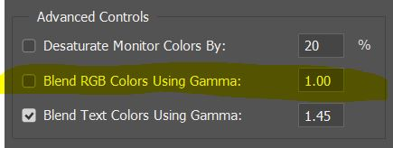 | 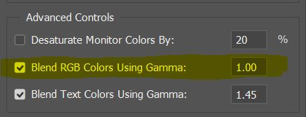 |
| Photoshop | 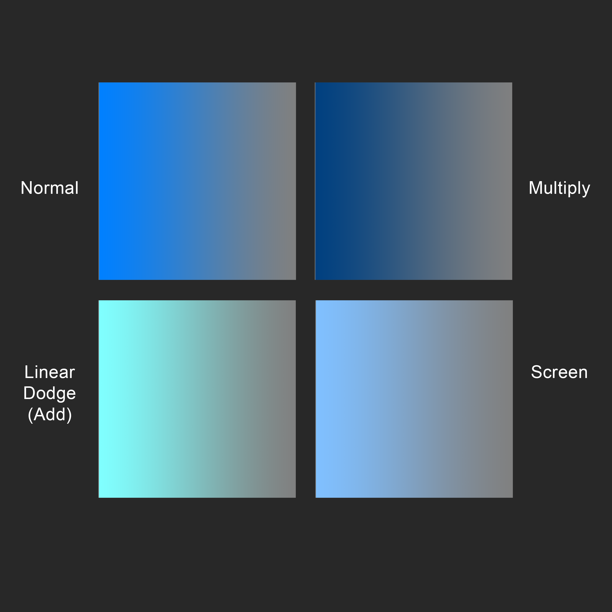 | 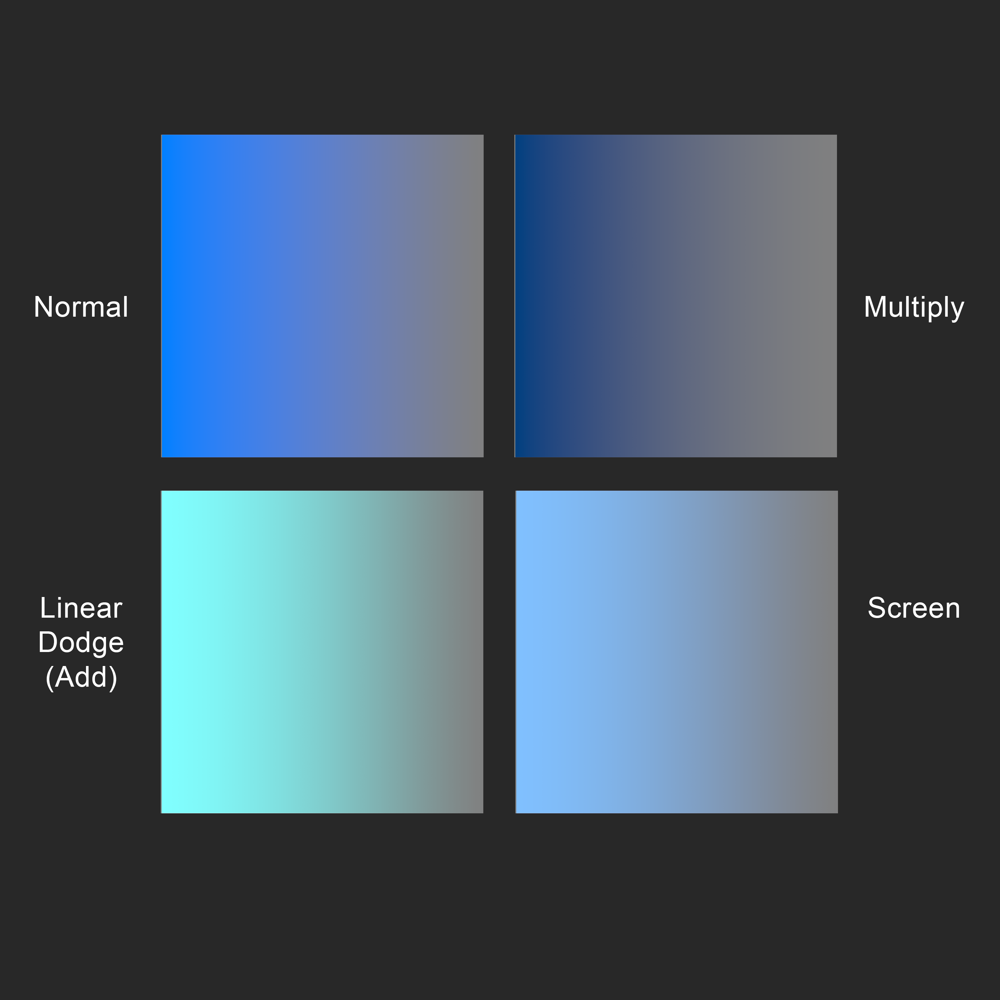 |
| Unity Player Settings | 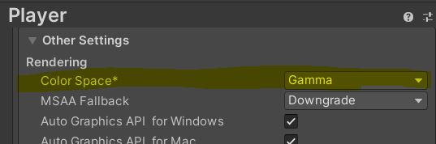 | 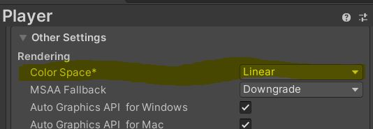 |
| Unity Shader Blend colors manually | 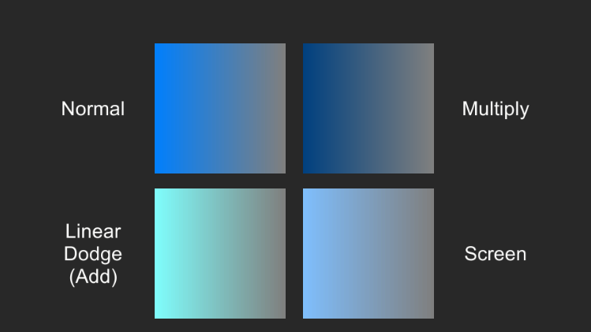 | 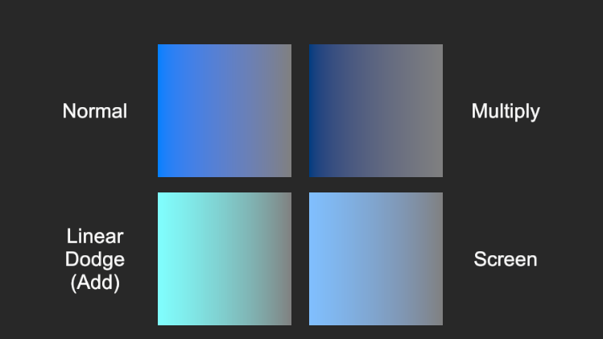 |
| Unity Simple transparent shader | 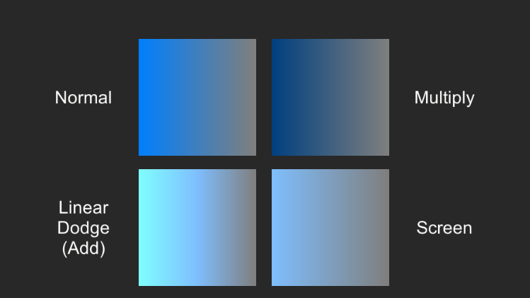 | 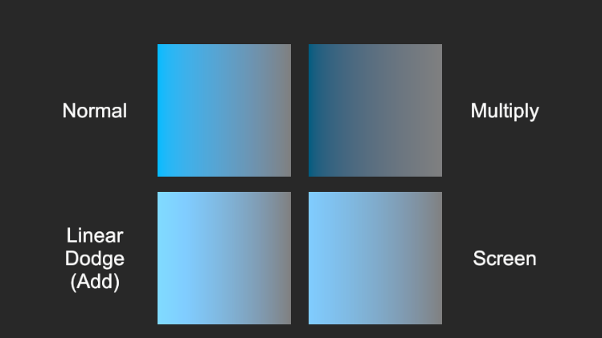 |
| Unity Default URP Particle shaders | 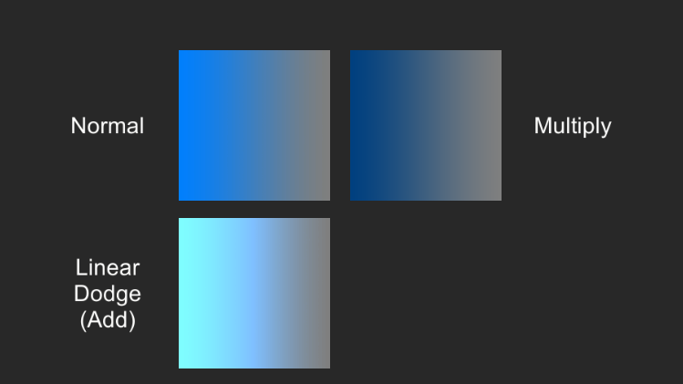 | 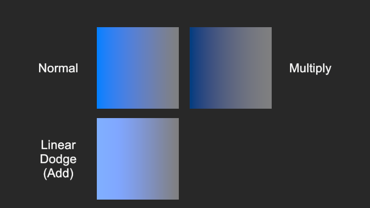 |

